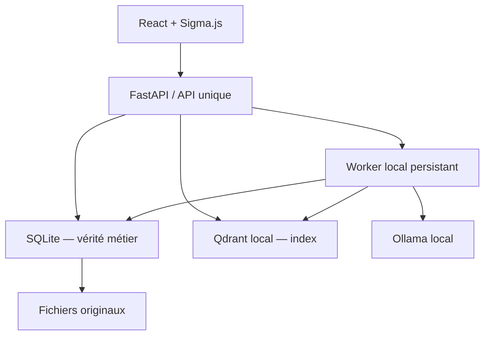

# Second Brain — architecture et plan de développement

Version de cadrage : 16 août 2026

## 1. Décision d’architecture

La stack proposée est adaptée à une application locale, mono-utilisateur et légère. Le MVP doit rester un **monolithe modulaire** : un frontend React compilé, un backend FastAPI, un processus de traitement local et trois formes de stockage local. Il n’y a pas besoin de microservices, Redis, Celery, Docker ou Kubernetes pour la V1.

Les principaux ajustements recommandés sont les suivants :

1. **SQLite est la source de vérité.** Les sources, segments, connaissances, preuves, tags, clusters, travaux et conversations y sont stockés. Qdrant ne contient qu’un index vectoriel reconstructible.
2. **Les fichiers originaux restent sur disque** dans un répertoire géré par l’application. La base ne conserve que leur chemin relatif, leur empreinte SHA-256 et le texte extrait.
3. **Qdrant fonctionne en mode local persistant**, dans le processus Python, sans port réseau. La documentation Qdrant confirme que le client Python peut persister ses vecteurs sur disque sans serveur séparé : [mode local Qdrant](https://qdrant.tech/documentation/frameworks/langchain/#local-mode).
4. **Ollama reste un processus local distinct**, joignable uniquement par FastAPI sur `127.0.0.1:11434`.
5. **Les imports longs passent par une file de travaux persistante dans SQLite.** Une simple `BackgroundTask` FastAPI n’est pas assez fiable pour un traitement de podcast de plusieurs minutes ; FastAPI réserve cette mécanique aux petites tâches et signale que les calculs lourds demandent une stratégie dédiée : [tâches d’arrière-plan FastAPI](https://fastapi.tiangolo.com/tutorial/background-tasks/#caveat).
6. **Le frontend compilé est servi par FastAPI en utilisation normale.** Il n’y a ainsi qu’un port à ouvrir sur le réseau local. Vite garde son serveur séparé uniquement en développement.
7. **Le changement de modèle d’embeddings est versionné.** Un changement de modèle ou de dimension crée un nouvel index puis ré-encode les connaissances. On ne mélange jamais deux espaces vectoriels incompatibles.

Le choix `qwen3.5:4b` est cohérent pour la machine visée si la variante quantifiée par défaut est utilisée : elle occupe environ 3,4 Go sur disque dans Ollama. Le modèle `qwen3-embedding:0.6b` occupe environ 639 Mo et prend en charge le français. Voir [Qwen 3.5 4B](https://ollama.com/library/qwen3.5:4b) et [Qwen3 Embedding](https://ollama.com/library/qwen3-embedding).

Pour limiter la RAM et le temps CPU, le contexte de génération doit commencer à **8 192 tokens**, même si le modèle accepte davantage, et le raisonnement doit être désactivé par défaut pour l’extraction structurée. Ces valeurs restent configurables.

### Vue d’ensemble



### Processus d’exécution

- Un seul processus Uvicorn avec **un worker** en V1.
- Au démarrage, le `lifespan` FastAPI initialise SQLite, Qdrant, les dépôts et un worker Python local.
- Le worker interroge la table `processing_jobs`, traite une seule génération Ollama à la fois et met à jour sa progression.
- Chaque étape est idempotente : après un arrêt du PC, le travail peut reprendre ou être relancé sans dupliquer les connaissances.
- Si les besoins dépassent un jour un seul PC, l’interface `JobRunner` pourra être remplacée par une vraie file sans réécrire le domaine métier.

### Bibliothèques recommandées

Backend :

- FastAPI, Uvicorn ;
- SQLAlchemy 2, Alembic, `aiosqlite` ;
- Pydantic Settings ;
- `httpx` pour Ollama, sans framework RAG généraliste ;
- `qdrant-client` en stockage local ;
- `pysrt` ou `srt` pour les sous-titres ;
- `pypdf` pour les PDF texte ;
- `ebooklib` et BeautifulSoup pour EPUB ;
- `numpy`, `scikit-learn`, `umap-learn`, `hdbscan` ;
- `tenacity` pour les reprises contrôlées.

Frontend :

- React, TypeScript, Vite ;
- React Router ;
- TanStack Query pour l’état serveur ;
- Sigma.js et Graphology ;
- Zod pour valider les réponses importantes ;
- CSS variables et composants maison légers ; pas de gros design system requis.

Sigma.js est conçu pour afficher par WebGL des graphes de milliers de nœuds et repose nativement sur Graphology : [documentation Sigma.js](https://www.sigmajs.org/docs/). La documentation annonce actuellement Sigma v4 en alpha ; le projet doit donc épingler la dernière version stable majeure plutôt que suivre automatiquement l’alpha.

## 2. Arborescence du repository

```text
second-brain/
├─ README.md
├─ LICENSE
├─ .gitignore
├─ .editorconfig
├─ .env.example
├─ pyproject.toml
├─ alembic.ini
├─ package.json                 # scripts racine facultatifs
├─ backend/
│  ├─ alembic/
│  │  ├─ env.py
│  │  └─ versions/
│  ├─ src/
│  │  └─ second_brain/
│  │     ├─ __init__.py
│  │     ├─ main.py
│  │     ├─ api/
│  │     │  ├─ dependencies.py
│  │     │  ├─ errors.py
│  │     │  └─ routes/
│  │     │     ├─ dashboard.py
│  │     │     ├─ sources.py
│  │     │     ├─ nodes.py
│  │     │     ├─ jobs.py
│  │     │     ├─ graph.py
│  │     │     ├─ search.py
│  │     │     ├─ chat.py
│  │     │     ├─ settings.py
│  │     │     └─ system.py
│  │     ├─ core/
│  │     │  ├─ config.py
│  │     │  ├─ logging.py
│  │     │  ├─ paths.py
│  │     │  ├─ security.py
│  │     │  └─ lifecycle.py
│  │     ├─ db/
│  │     │  ├─ base.py
│  │     │  ├─ session.py
│  │     │  ├─ models/
│  │     │  │  ├─ source.py
│  │     │  │  ├─ knowledge.py
│  │     │  │  ├─ taxonomy.py
│  │     │  │  ├─ processing.py
│  │     │  │  ├─ embedding.py
│  │     │  │  └─ chat.py
│  │     │  └─ repositories/
│  │     ├─ schemas/
│  │     │  ├─ source.py
│  │     │  ├─ knowledge.py
│  │     │  ├─ graph.py
│  │     │  ├─ job.py
│  │     │  ├─ rag.py
│  │     │  └─ settings.py
│  │     ├─ parsers/
│  │     │  ├─ base.py
│  │     │  ├─ registry.py
│  │     │  ├─ srt_parser.py
│  │     │  ├─ txt_parser.py
│  │     │  ├─ pdf_parser.py
│  │     │  ├─ epub_parser.py
│  │     │  └─ manual_parser.py
│  │     ├─ llm/
│  │     │  ├─ client.py
│  │     │  ├─ schemas.py
│  │     │  ├─ prompts/
│  │     │  │  ├─ extract_nodes.md
│  │     │  │  ├─ summarize_passage.md
│  │     │  │  ├─ summarize_source.md
│  │     │  │  ├─ label_cluster.md
│  │     │  │  ├─ rag_strict.md
│  │     │  │  └─ rag_mixed.md
│  │     │  └─ services/
│  │     │     ├─ extraction.py
│  │     │     ├─ summarization.py
│  │     │     └─ generation.py
│  │     ├─ vector/
│  │     │  ├─ embeddings.py
│  │     │  ├─ qdrant_store.py
│  │     │  ├─ index_manager.py
│  │     │  └─ retrieval.py
│  │     ├─ pipeline/
│  │     │  ├─ import_pipeline.py
│  │     │  ├─ chunking.py
│  │     │  ├─ deduplication.py
│  │     │  ├─ stages.py
│  │     │  └─ progress.py
│  │     ├─ graph/
│  │     │  ├─ neighbors.py
│  │     │  ├─ clustering.py
│  │     │  ├─ hierarchy.py
│  │     │  ├─ projection.py
│  │     │  └─ graph_service.py
│  │     ├─ rag/
│  │     │  ├─ service.py
│  │     │  ├─ context_builder.py
│  │     │  ├─ citation_validator.py
│  │     │  └─ answer_schema.py
│  │     ├─ jobs/
│  │     │  ├─ runner.py
│  │     │  ├─ queue.py
│  │     │  ├─ handlers.py
│  │     │  └─ recovery.py
│  │     └─ static/             # build frontend copié ici
│  └─ tests/
│     ├─ unit/
│     ├─ integration/
│     ├─ api/
│     ├─ fixtures/
│     └─ conftest.py
├─ frontend/
│  ├─ package.json
│  ├─ vite.config.ts
│  ├─ tsconfig.json
│  ├─ index.html
│  └─ src/
│     ├─ main.tsx
│     ├─ app/
│     │  ├─ router.tsx
│     │  ├─ queryClient.ts
│     │  └─ providers.tsx
│     ├─ api/
│     │  ├─ client.ts
│     │  └─ generated-or-types.ts
│     ├─ components/
│     │  ├─ layout/
│     │  ├─ common/
│     │  ├─ sources/
│     │  ├─ knowledge/
│     │  ├─ graph/
│     │  ├─ chat/
│     │  └─ jobs/
│     ├─ pages/
│     │  ├─ DashboardPage.tsx
│     │  ├─ AddPage.tsx
│     │  ├─ SourcesPage.tsx
│     │  ├─ SourceDetailPage.tsx
│     │  ├─ BrainPage.tsx
│     │  ├─ SearchPage.tsx
│     │  └─ SettingsPage.tsx
│     ├─ hooks/
│     ├─ theme/
│     ├─ types/
│     └─ tests/
├─ scripts/
│  ├─ dev.ps1
│  ├─ build.ps1
│  ├─ start.ps1
│  ├─ check.ps1
│  └─ backup.ps1
├─ data/                        # ignoré par Git
│  ├─ second_brain.sqlite3
│  ├─ originals/
│  ├─ qdrant/
│  ├─ exports/
│  └─ logs/
└─ docs/
   ├─ architecture.md
   ├─ api.md
   ├─ data-model.md
   └─ development-plan.md
```

Le code doit dépendre d’interfaces internes simples (`TextGenerator`, `EmbeddingProvider`, `VectorStore`, `SourceParser`). Cela permet de changer de modèle ou de moteur sans introduire un framework comme LangChain dans le cœur du projet.

## 3. Modèle de données

Toutes les dates sont en UTC. Les identifiants métier sont des UUID. Les chemins enregistrés sont relatifs au répertoire `DATA_DIR`. SQLite active `foreign_keys=ON` et le mode WAL.

### `sources`

| Champ | Type | Rôle |
|---|---|---|
| `id` | UUID PK | Identifiant |
| `type` | enum | `srt`, `txt`, `pdf`, `epub`, `manual` |
| `title` | texte | Titre fourni ou déduit |
| `author` | texte nullable | Auteur saisi |
| `original_filename` | texte nullable | Nom visible d’origine |
| `original_file_path` | texte nullable | Chemin relatif du fichier immuable |
| `file_sha256` | texte nullable, index | Détection des doublons |
| `raw_text` | texte | Texte extrait/normalisé, pas le fichier original |
| `summary` | texte nullable | Résumé global détaillé |
| `language` | texte nullable | Langue détectée ou choisie |
| `processing_status` | enum | `pending`, `processing`, `ready`, `partial`, `failed` |
| `error_message` | texte nullable | Dernière erreur lisible |
| `created_at`, `updated_at` | datetime | Audit |

### `source_segments`

Un segment correspond à l’unité fidèle à la source : entrée SRT, page/fragment PDF, chapitre/fragment EPUB ou bloc texte.

| Champ | Type | Rôle |
|---|---|---|
| `id` | UUID PK | Identifiant |
| `source_id` | FK | Source |
| `index` | entier | Ordre stable dans la source |
| `text` | texte | Texte fidèle extrait |
| `start_ms`, `end_ms` | entier nullable | Localisation SRT |
| `page_number` | entier nullable | Localisation PDF |
| `chapter_title` | texte nullable | Localisation EPUB |
| `char_start`, `char_end` | entier nullable | Localisation TXT/manuelle |

Contrainte unique : `(source_id, index)`.

### `source_passages`

Un passage est un regroupement sémantique envoyé au LLM. Il ne remplace jamais les segments originaux.

| Champ | Type | Rôle |
|---|---|---|
| `id` | UUID PK | Identifiant |
| `source_id` | FK | Source |
| `index` | entier | Ordre |
| `text` | texte | Texte regroupé |
| `first_segment_index`, `last_segment_index` | entier | Traçabilité |
| `token_count` | entier | Contrôle de taille |
| `intermediate_summary` | texte nullable | Résumé hiérarchique |
| `processing_status` | enum | Reprise par étape |

### `knowledge_nodes`

| Champ | Type | Rôle |
|---|---|---|
| `id` | UUID PK | Identifiant également utilisé dans Qdrant |
| `primary_source_id` | FK | Source principale |
| `title` | texte | Titre généré/modifiable |
| `content` | texte | Connaissance autonome |
| `content_hash` | texte | Détection de modification/doublon |
| `status` | enum | `active`, `archived`, `superseded` |
| `is_user_edited` | bool | Protège les modifications lors d’un retraitement |
| `embedding_status` | enum | `pending`, `indexed`, `stale`, `failed` |
| `embedding_profile_id` | FK nullable | Espace vectoriel actif |
| `created_at`, `updated_at` | datetime | Audit |

### `knowledge_evidence`

Cette table est indispensable pour des citations fiables et permet à une connaissance d’être soutenue par plusieurs passages ou sources.

| Champ | Type | Rôle |
|---|---|---|
| `id` | UUID PK | Identifiant |
| `knowledge_node_id` | FK | Connaissance |
| `source_id` | FK | Source citée |
| `passage_id` | FK nullable | Passage d’extraction |
| `first_segment_id`, `last_segment_id` | FK nullable | Plage exacte |
| `original_excerpt` | texte | Extrait affichable |
| `start_ms`, `end_ms`, `page_number`, `chapter_title` | nullable | Localisateur dénormalisé pratique |

### Tags

- `tags(id, name, normalized_name, created_at)` ;
- `knowledge_node_tags(knowledge_node_id, tag_id, confidence)` ;
- unicité de `tags.normalized_name` et de la paire nœud/tag.

Les tags ne sont pas stockés sous forme de chaîne JSON dans `knowledge_nodes`, car les jointures, filtres et renommages deviendraient fragiles.

### Clusters et graphe

- `cluster_runs(id, algorithm_version, embedding_profile_id, status, parameters_json, created_at, activated_at)` ;
- `clusters(id, run_id, label, description, level, parent_cluster_id, size, x, y, color)` ;
- `cluster_memberships(cluster_id, knowledge_node_id, confidence)` ;
- `semantic_edges(id, run_id, source_node_id, target_node_id, cosine_score, tag_bonus, final_score)`.

Un `cluster_run` complet est construit à côté du graphe actif. Il ne devient actif qu’une fois terminé, ce qui évite d’afficher une hiérarchie partiellement recalculée.

### Traitements

`processing_jobs` :

- `id`, `kind`, `source_id` nullable ;
- `status` : `pending`, `running`, `succeeded`, `failed`, `cancelled`, `interrupted` ;
- `stage`, `progress_current`, `progress_total`, `progress_message` ;
- `payload_json`, `attempt_count`, `max_attempts` ;
- `cancel_requested`, `error_code`, `error_message` ;
- `created_at`, `started_at`, `heartbeat_at`, `finished_at`.

Au démarrage, un travail resté `running` sans heartbeat est marqué `interrupted`, puis remis en attente seulement si l’étape est réexécutable.

### Profils d’embeddings et configuration

`embedding_profiles` :

- `id`, `provider`, `model_name`, `dimensions`, `distance` ;
- `collection_name`, `document_instruction`, `query_instruction` ;
- `status` : `building`, `active`, `retired`, `failed` ;
- `created_at`, `activated_at`.

`app_settings(key, value_json, updated_at)` contient les réglages modifiables dans l’interface. Les variables d’environnement gardent la priorité pour les chemins et paramètres de sécurité.

### Conversation RAG

- `chat_sessions(id, title, default_mode, created_at, updated_at)` ;
- `chat_messages(id, session_id, role, content, mode, created_at)` ;
- `chat_citations(message_id, knowledge_node_id, rank, similarity_score)`.

## 4. Endpoints FastAPI

Préfixe : `/api/v1`. Les listes utilisent `limit`, `cursor` et des filtres ; éviter la pagination par offset pour les grandes tables.

### Système et tableau de bord

| Méthode | Route | Usage |
|---|---|---|
| `GET` | `/system/health` | API et SQLite accessibles |
| `GET` | `/system/readiness` | État d’Ollama, modèle, Qdrant, espace disque |
| `GET` | `/system/models` | Modèles Ollama disponibles |
| `GET` | `/dashboard` | Compteurs, domaines, ajouts et travaux récents |

### Sources et imports

| Méthode | Route | Usage |
|---|---|---|
| `POST` | `/sources/upload` | Un fichier multipart + titre/auteur facultatifs, retourne source et job |
| `POST` | `/sources/manual` | Texte libre, retourne source et job |
| `GET` | `/sources` | Liste filtrée et paginée |
| `GET` | `/sources/{id}` | Détail et état |
| `GET` | `/sources/{id}/segments` | Texte source localisé |
| `GET` | `/sources/{id}/summary` | Résumé global |
| `GET` | `/sources/{id}/nodes` | Connaissances extraites |
| `POST` | `/sources/{id}/reprocess` | Nouveau travail contrôlé |
| `DELETE` | `/sources/{id}` | Suppression explicite avec politique documentée |

La suppression doit retirer dans une transaction logique les nœuds exclusifs, preuves et points Qdrant, puis le fichier. Une confirmation d’interface est obligatoire.

### Connaissances

| Méthode | Route | Usage |
|---|---|---|
| `GET` | `/nodes` | Recherche, tags, source, cluster |
| `GET` | `/nodes/{id}` | Contenu, preuves, source, relations |
| `PATCH` | `/nodes/{id}` | Modifier titre/contenu/tags |
| `POST` | `/nodes/{id}/reembed` | Ré-indexation explicite si nécessaire |
| `GET` | `/nodes/{id}/related` | Voisins sémantiques |
| `DELETE` | `/nodes/{id}` | Archivage par défaut, purge séparée ultérieure |

Un `PATCH` qui change le contenu met immédiatement `embedding_status=stale`, crée un travail de ré-embedding et invalide le graphe actif après réussite.

### Travaux

| Méthode | Route | Usage |
|---|---|---|
| `GET` | `/jobs` | Travaux récents |
| `GET` | `/jobs/{id}` | Étape, progression et erreur |
| `POST` | `/jobs/{id}/cancel` | Demande d’annulation coopérative |
| `POST` | `/jobs/{id}/retry` | Relance autorisée |
| `GET` | `/jobs/events` | SSE facultatif pour les mises à jour d’interface |

### Recherche et RAG

| Méthode | Route | Usage |
|---|---|---|
| `POST` | `/search/semantic` | Résultats vectoriels bruts |
| `POST` | `/chat/sessions` | Nouvelle conversation |
| `GET` | `/chat/sessions/{id}` | Historique et citations |
| `POST` | `/chat/sessions/{id}/messages` | Question avec mode `brain_only` ou `brain_plus_model` |

Pour la V1, la réponse RAG peut être non streamée afin de valider complètement le JSON et les citations avant affichage. Le streaming SSE pourra être ajouté quand ce contrat sera stable.

### Graphe

| Méthode | Route | Usage |
|---|---|---|
| `GET` | `/graph/root` | Domaines du graphe actif |
| `GET` | `/graph/clusters/{id}/children` | Niveau inférieur et arêtes agrégées |
| `GET` | `/graph/clusters/{id}/nodes` | Nœuds feuille d’un sous-thème |
| `GET` | `/graph/nodes/{id}/neighborhood` | Voisinage centré et borné |
| `POST` | `/graph/rebuild` | Lance un travail de reclustering |
| `GET` | `/graph/status` | Version active et fraîcheur |

Le backend ne renvoie jamais toutes les paires possibles. Il renvoie un graphe sparse et limité au niveau visible.

### Paramètres

- `GET /settings` ;
- `PATCH /settings` ;
- `POST /settings/test-ollama` ;
- `POST /settings/embedding-profile/rebuild`.

Changer le modèle de génération est immédiat. Changer le modèle ou la dimension d’embedding affiche un avertissement et lance la création d’un nouvel index.

## 5. Pipeline d’import

### Étapes communes

1. **Réception sécurisée** : vérifier extension, taille et signature basique ; attribuer un UUID ; ne jamais utiliser le nom original comme chemin.
2. **Empreinte et copie immuable** : calcul SHA-256 puis copie atomique dans `data/originals/<source_id>/original.<ext>`.
3. **Détection de doublon** : si l’empreinte existe, demander confirmation ou rattacher les métadonnées sans retraiter automatiquement.
4. **Parsing** : sélectionner un `SourceParser` via un registre.
5. **Persistance des segments** : écrire les unités fidèles et le texte normalisé.
6. **Construction des passages** : regrouper sans dépasser le budget de tokens.
7. **Résumé intermédiaire** : produire un résumé factuel par passage ou groupe de passages.
8. **Extraction atomique** : demander au LLM une liste JSON de connaissances avec titre, contenu, tags et indices de preuves.
9. **Validation** : Pydantic valide le schéma, les longueurs, les indices et les extraits. Une réponse invalide est réparée une fois puis mise en erreur explicite.
10. **Déduplication** : détection exacte par hash puis quasi-doublon par similarité. Le MVP signale ou relie les quasi-doublons ; il ne fusionne pas silencieusement deux connaissances.
11. **Résumé global hiérarchique** : synthétiser les résumés intermédiaires en plusieurs lots, puis synthétiser leurs résultats.
12. **Embeddings par lots** : encoder titre + contenu et indexer les UUID dans Qdrant.
13. **Voisinage et graphe** : calculer les voisins des nouveaux nœuds puis programmer un reclustering différé.
14. **Finalisation** : la source passe à `ready` ou `partial` si certaines unités ont échoué.

Ollama permet d’imposer un schéma JSON au champ `format`, ce qui convient à l’extraction de connaissances : [sorties structurées Ollama](https://docs.ollama.com/capabilities/structured-outputs). L’application doit néanmoins valider le résultat côté Python.

### Découpage SRT

1. Parser toutes les entrées et conserver index, texte, début et fin.
2. Nettoyer seulement la copie de travail : balises de style, espaces répétés et répétitions techniques ; le texte segmenté fidèle reste conservé.
3. Former un passage en respectant dans l’ordre :
   - pause longue entre deux sous-titres ;
   - ponctuation de fin ;
   - changement manifeste de sujet, si une heuristique légère le détecte ;
   - cible initiale de 600 à 900 tokens ;
   - plafond initial de 1 200 tokens ;
   - chevauchement de 1 à 3 segments, pas un chevauchement arbitraire de caractères.
4. Extraire les connaissances passage par passage avec leurs indices de segments.
5. Construire le résumé du podcast en map-reduce : passages → résumés de sections → résumé global.

Ces valeurs sont des réglages initiaux à mesurer, pas des constantes métier.

### TXT et texte manuel

- Segmenter d’abord par titres et paragraphes.
- Regrouper les petits paragraphes jusqu’à la cible de tokens.
- Pour un texte très court, une seule requête structurée peut produire directement une ou plusieurs connaissances.

### PDF

- Extraire page par page avec `pypdf`.
- Conserver `page_number` dans chaque segment et chaque preuve.
- Si une proportion trop faible de pages contient du texte, marquer `needs_ocr` et expliquer que l’OCR n’est pas disponible en V1.
- Limiter pages, taille décompressée et temps de parsing pour les fichiers non fiables.

### EPUB

- Refuser les chemins sortant de l’archive et limiter la taille totale décompressée.
- Lire la spine dans l’ordre, retirer scripts/styles, conserver le titre de chapitre.
- Segmenter par chapitre puis paragraphes.

### Reprise et cohérence

- Chaque stage écrit son résultat puis valide la transaction avant le suivant.
- Un stage terminé n’est pas recalculé lors d’une reprise, sauf demande explicite.
- Un retraitement crée un nouvel `extraction_run`. Les connaissances modifiées manuellement ne sont jamais écrasées automatiquement.
- La suppression d’un travail incomplet ne supprime pas le fichier original ni les segments déjà valides.

## 6. RAG et citations

### Recherche commune aux deux modes

1. Normaliser la question sans la réécrire de façon agressive.
2. L’encoder avec **le même profil** que les connaissances. Ollama recommande le même modèle pour l’indexation et les requêtes, et renvoie des vecteurs normalisés L2 : [embeddings Ollama](https://docs.ollama.com/capabilities/embeddings).
3. Interroger Qdrant en cosinus, `top_k` initial de 24.
4. Écarter les nœuds inactifs et appliquer les filtres éventuels de source/tag.
5. Diversifier les résultats par MMR ou, au minimum, limiter le nombre de nœuds presque identiques d’une même source.
6. Retenir environ 8 à 12 nœuds dans le budget de contexte.
7. Fournir au LLM des blocs numérotés contenant uniquement `node_id`, titre, contenu et extrait de preuve utile.

Le score des tags ne doit pas altérer le classement principal. Une formule initiale acceptable pour les relations du graphe est :

`score_final = 0,95 × similarité_cosinus + 0,05 × Jaccard(tags)`

Le seuil et le poids restent configurables et devront être calibrés sur des exemples réels.

### Mode « Second cerveau uniquement »

Le prompt système impose :

- n’utiliser que les blocs fournis ;
- répondre « Le second cerveau ne contient pas suffisamment d’informations » si le contexte ne permet pas une réponse fiable ;
- associer chaque affirmation factuelle à un ou plusieurs `node_id` autorisés ;
- ne jamais inventer un identifiant ou une source.

La sortie est un JSON validé, par exemple :

```json
{
  "sufficient": true,
  "answer_markdown": "...",
  "citations": [
    {"node_id": "uuid", "claim": "..."}
  ]
}
```

Le backend rejette toute citation qui ne figure pas dans le contexte récupéré. Une consigne ne peut pas effacer les connaissances internes du modèle de manière absolue ; la garantie réaliste vient donc d’une réponse structurée, de citations obligatoires et de la possibilité de refuser une réponse non étayée.

### Mode « Second cerveau + modèle »

La sortie comporte deux champs séparés :

- `from_brain` : réponse sourcée uniquement par les nœuds ;
- `model_additions` : compléments généraux clairement présentés comme non issus du second cerveau.

L’interface rend les deux parties dans des panneaux visuellement distincts. Les citations ne sont affichées que sur la partie `from_brain`.

### Affichage d’une citation

Le clic sur une puce de citation ouvre un panneau avec :

- titre et contenu du neurone ;
- source et auteur ;
- extrait original ;
- timestamp début-fin, page ou chapitre ;
- lien vers la page du neurone et vers la source.

### Évolutions après le MVP

- recherche hybride dense + SQLite FTS5 ;
- réécriture multi-requêtes pour les questions complexes ;
- reranker local léger ;
- citations au niveau de chaque phrase ;
- évaluation RAG automatisée sur un jeu de questions personnel.

## 7. Clustering, relations et semantic zoom

### Principe important

**UMAP ne doit pas décider des clusters.** Il réduit les embeddings à deux dimensions pour l’affichage et déforme nécessairement certaines distances. Le clustering travaille sur les embeddings originaux normalisés, éventuellement après une PCA vers environ 50 dimensions pour réduire le bruit et le coût CPU.

### Pipeline de graphe recommandé

1. Charger tous les embeddings actifs.
2. Construire pour chaque nœud ses 8 à 12 plus proches voisins.
3. Conserver au maximum `k` arêtes par nœud, avec seuil minimal et préférence pour les liens mutuels.
4. Calculer les sous-thèmes avec HDBSCAN sur les vecteurs préparés. Les points bruités restent visibles et peuvent être rattachés seulement pour la navigation, avec une confiance faible explicite.
5. Calculer le centroïde et les représentants de chaque sous-thème.
6. Regrouper les centroïdes par clustering agglomératif pour former les thèmes, puis les domaines.
7. Générer les labels à partir de 5 à 8 nœuds représentatifs proches du centroïde. Le LLM doit produire un libellé court et une description, sans choisir dans une liste figée.
8. Projeter les nœuds avec UMAP 2D et un `random_state` fixe. Les coordonnées des clusters sont les centroïdes visuels de leurs enfants.
9. Construire le nouveau `cluster_run`, puis l’activer atomiquement.

La hiérarchie est adaptative :

- moins de 40 nœuds : afficher directement les connaissances ou un seul niveau ;
- ensemble moyen : domaines → sous-thèmes → connaissances ;
- grand ensemble : domaines → thèmes → sous-thèmes → connaissances.

Il ne faut pas fabriquer quatre niveaux vides simplement pour respecter un schéma visuel.

### Arêtes

- Nœud-nœud : similarité cosinus principale + petit bonus de tags.
- Cluster-cluster : somme ou moyenne tronquée des meilleures arêtes entre leurs membres.
- Ne jamais produire un graphe complet en `O(n²)` dans l’API ou le navigateur.
- Les arêtes faibles sont cachées par défaut et révélées au survol, à la sélection ou à fort zoom.

### Semantic zoom côté interface

| Niveau caméra | Affichage |
|---|---|
| Très éloigné | Domaines uniquement |
| Éloigné | Domaines et thèmes du domaine ciblé |
| Moyen | Sous-thèmes et quelques labels représentatifs |
| Proche | Neurones du sous-thème ouvert et relations locales |

La caméra déclenche un chargement du niveau inférieur lorsque le seuil de zoom est franchi. Les données déjà chargées restent en cache via TanStack Query. Une transition anime les positions parent-enfants pour éviter la désorientation.

Sigma rend les nœuds ; Graphology garde le graphe courant et ses attributs. Les calculs lourds restent côté Python. ForceAtlas2 peut servir seulement à un léger anti-chevauchement final ; il exige des positions initiales et ne remplace pas UMAP : [ForceAtlas2 Graphology](https://graphology.github.io/standard-library/layout-forceatlas2.html).

### Stabilité visuelle

- fixer la graine UMAP ;
- conserver les couleurs d’un cluster lorsqu’il correspond fortement à un ancien cluster ;
- ne recalculer le graphe qu’après un lot d’imports ou sur demande, pas après chaque neurone ;
- maintenir l’ancien graphe visible pendant le calcul du nouveau ;
- afficher la date et l’état de fraîcheur du graphe.

## 8. Pages et composants React

### Structure générale

`AppShell` contient :

- `Sidebar` avec Dashboard, Ajouter, Sources, Cerveau, Recherche IA, Paramètres ;
- `TopBar` avec recherche globale, état Ollama et indicateur de travaux ;
- `JobDrawer` affichant progression, annulation, reprise et erreurs ;
- thème clair/sombre géré par variables CSS.

### Dashboard

Composants :

- `GlobalSearchBar` ;
- `StatCard` pour sources, neurones et travaux ;
- `DomainOverview` ;
- `RecentSources` ;
- `RecentNodes` ;
- `ProcessingTimeline` ;
- `SystemStatusBadge`.

### Ajouter

- `FileDropzone` avec types et taille acceptés ;
- `ImportMetadata` limité à titre et auteur facultatifs ;
- `ManualTextEditor` ;
- `ImportPreview` ;
- `ImportProgressCard`.

L’utilisateur peut lancer l’import immédiatement. Les métadonnées facultatives ne bloquent jamais le flux.

### Sources

- `SourceTable` ou cartes compactes ;
- filtres type, état, auteur et date ;
- `SourceDetailPage` avec onglets `Résumé`, `Texte`, `Informations`, `Neurones` ;
- `SourceTextViewer` capable de faire défiler jusqu’au segment cité ;
- `TimestampLink` pour SRT.

### Cerveau

- `BrainCanvas` : instance Sigma isolée ;
- `GraphToolbar` : recherche, recentrage, filtres, niveau et reconstruction ;
- `GraphLegend` ;
- `NodeDetailsPanel` ;
- `ClusterDetailsPanel` ;
- `Breadcrumb` domaine/thème/sous-thème ;
- `GraphSearch` qui centre la caméra et ouvre les ancêtres nécessaires.

### Recherche IA

- `ConversationList` ;
- `ChatThread` ;
- `QuestionComposer` ;
- `RagModeToggle` avec explication concise ;
- `BrainAnswerSection` ;
- `ModelAdditionSection` ;
- `CitationChip` et `CitationDrawer` ;
- état « information insuffisante » prévu comme résultat normal, pas comme erreur.

### Paramètres

- état et URL locale d’Ollama ;
- modèle de génération et modèle d’embedding ;
- contexte, température, taille des chunks, `top_k` ;
- répertoire de données en lecture seule dans l’interface V1 ;
- bouton de test ;
- avertissement de ré-indexation lors d’un changement d’embedding ;
- export/sauvegarde dans une phase ultérieure.

### Gestion d’état

- TanStack Query pour données API, cache et invalidations ;
- état local React pour caméra, panneau actif et formulaire ;
- pas de Redux au départ ;
- types générés depuis OpenAPI ou partagés par génération, jamais recopiés manuellement à long terme.

## 9. Configuration

Configuration à deux niveaux : variables d’environnement pour l’installation, table `app_settings` pour les réglages modifiables dans l’UI.

### Installation et réseau

```dotenv
SECOND_BRAIN_ENV=development
SECOND_BRAIN_HOST=127.0.0.1
SECOND_BRAIN_PORT=8000
SECOND_BRAIN_DATA_DIR=./data
SECOND_BRAIN_DATABASE_URL=sqlite+aiosqlite:///./data/second_brain.sqlite3
SECOND_BRAIN_LOG_LEVEL=INFO
SECOND_BRAIN_ALLOWED_ORIGINS=http://localhost:5173,http://127.0.0.1:5173
SECOND_BRAIN_MAX_UPLOAD_MB=200
```

Pour l’accès téléphone, passer volontairement `SECOND_BRAIN_HOST=0.0.0.0`, servir le build React par FastAPI et autoriser l’application dans le pare-feu Windows sur réseau privé seulement.

### Ollama

```dotenv
OLLAMA_BASE_URL=http://127.0.0.1:11434
OLLAMA_GENERATION_MODEL=qwen3.5:4b
OLLAMA_EMBEDDING_MODEL=qwen3-embedding:0.6b
OLLAMA_REQUEST_TIMEOUT_SECONDS=600
OLLAMA_NUM_CTX=8192
OLLAMA_TEMPERATURE=0.2
OLLAMA_THINK=false
OLLAMA_KEEP_ALIVE=5m
OLLAMA_MAX_CONCURRENT_GENERATIONS=1
```

### Embeddings et Qdrant

```dotenv
QDRANT_PATH=./data/qdrant
QDRANT_COLLECTION_PREFIX=second_brain_nodes
EMBEDDING_DIMENSIONS=0
EMBEDDING_BATCH_SIZE=8
EMBEDDING_DOCUMENT_INSTRUCTION=
EMBEDDING_QUERY_INSTRUCTION=
```

`EMBEDDING_DIMENSIONS=0` signifie : détecter la longueur sur un embedding test puis créer le profil. L’API Ollama accepte également une dimension explicite pour les modèles compatibles : [endpoint embed](https://docs.ollama.com/api/embed).

### Pipeline

```dotenv
CHUNK_TARGET_TOKENS=800
CHUNK_MAX_TOKENS=1200
CHUNK_OVERLAP_SEGMENTS=2
EXTRACTION_MAX_RETRIES=2
JOB_POLL_INTERVAL_MS=750
JOB_STALE_HEARTBEAT_SECONDS=120
RAG_RETRIEVAL_TOP_K=24
RAG_CONTEXT_MAX_NODES=10
GRAPH_NEIGHBORS_K=8
GRAPH_MIN_SIMILARITY=0.55
GRAPH_TAG_WEIGHT=0.05
CLUSTER_MIN_SIZE=6
UMAP_RANDOM_STATE=42
```

Les réglages algorithmiques sont des valeurs de départ. Ils doivent être affichés dans une section « avancée » et validés sur le corpus réel avant d’être considérés comme de bons défauts.

### Changement de modèle

- génération : vérifier que le modèle existe, puis mettre à jour le réglage ;
- embedding : créer un `embedding_profile` en `building`, détecter la dimension, créer une nouvelle collection, ré-encoder par lots, vérifier le nombre de points, activer le profil et reconstruire le graphe ;
- conserver l’ancien index jusqu’à réussite ;
- pouvoir revenir au profil précédent ;
- ne jamais modifier une collection existante avec des vecteurs de taille différente.

## 10. Stratégie de tests

### Tests unitaires backend

- parsing SRT : timestamps, HTML, entrées vides, chevauchements ;
- parsing TXT/PDF/EPUB et localisateurs ;
- chunking : plafonds, chevauchements, ordre, unicité ;
- calcul de hash et déduplication ;
- validation des sorties LLM et citations ;
- formule de score tags/embeddings ;
- transitions d’état des travaux ;
- invalidation d’embedding après modification.

### Tests d’intégration backend

- SQLite temporaire + Qdrant local temporaire ;
- faux serveur Ollama ou adaptateur déterministe ;
- import complet d’un petit SRT jusqu’aux nœuds ;
- reprise après interruption à chaque stage ;
- modification d’un nœud puis ré-embedding ;
- RAG strict avec citation valide, citation inventée et contexte insuffisant ;
- migration d’un profil d’embedding vers une autre dimension ;
- reconstruction atomique du graphe.

Les tests automatiques ne doivent pas télécharger de modèle Ollama. Un test manuel opt-in peut utiliser le vrai modèle.

### Fixtures de référence

Conserver dans le dépôt :

- un SRT court en français avec timestamps connus ;
- un TXT structuré ;
- un PDF texte de deux pages créé pour les tests ;
- un EPUB minimal ;
- plusieurs réponses Ollama valides et invalides ;
- un petit jeu d’embeddings artificiels avec clusters attendus.

### Frontend

- Vitest + React Testing Library : formulaires, statuts, citations, panneaux ;
- tests du changement de niveau de graphe avec adaptateur Sigma simulé ;
- Playwright : ajouter un texte, attendre le travail, ouvrir un neurone, poser une question et ouvrir sa citation ;
- vérification responsive sur largeur téléphone.

### Contrats et qualité

- OpenAPI vérifié et types frontend régénérés en CI ;
- Ruff pour format/lint Python, mypy ou Pyright sur le cœur ;
- ESLint, TypeScript strict et Prettier ;
- couverture ciblée sur parsers, pipeline, RAG et travaux plutôt qu’un pourcentage global artificiel.

### Benchmarks locaux

Créer un script reproductible pour :

- 100, 1 000 et 5 000 neurones ;
- temps et mémoire d’embedding ;
- latence Qdrant hors génération ;
- durée du reclustering ;
- fluidité du graphe aux quatre niveaux ;
- traitement d’une heure de SRT.

Les critères d’acceptation doivent être mesurés sur le PC cible. Le poids du modèle, le contexte et les processus déjà ouverts influencent fortement la RAM et les temps CPU.

## 11. Ordre de développement en lots Codex

Chaque lot ci-dessous doit être transmis séparément à Codex. Il possède un objectif observable, des limites et une définition de fini. Ne pas demander plusieurs lots en une seule implémentation.

### Lot 0 — Squelette exécutable

**Objectif :** créer le monorepo, FastAPI, React/Vite, scripts PowerShell et contrôle qualité.

**Inclus :** `/api/v1/system/health`, page React minimale, proxy Vite, configuration typée, tests fumée, README d’installation Windows.

**Exclus :** base métier, Ollama, Qdrant, imports.

**Fini quand :** `scripts/dev.ps1` lance les deux applications et les commandes de test/lint passent.

### Lot 1 — SQLite, migrations et paramètres système

**Objectif :** installer SQLAlchemy/Alembic, les modèles `Source` et `ProcessingJob`, les chemins de données et le `lifespan`.

**Inclus :** mode WAL, migrations, dépôts, readiness sans dépendance obligatoire, page Paramètres minimale.

**Fini quand :** une base neuve est créée, migrée et testée dans un répertoire temporaire.

### Lot 2 — Ajout de texte manuel et TXT sans IA

**Objectif :** fiabiliser le chemin d’import avant d’ajouter le LLM.

**Inclus :** upload sécurisé TXT, texte manuel, SHA-256, copie immuable, segments, liste/détail des sources, faux job synchrone de parsing.

**Fini quand :** le texte importé est consultable et relié à son original, avec tests de doublon et de chemin malveillant.

### Lot 3 — Parsing et visualisation SRT

**Objectif :** conserver exactement la structure temporelle des podcasts.

**Inclus :** parser SRT, segments, passages heuristiques, auteur, visionneuse avec timestamps, fixtures.

**Exclus :** appel Ollama et connaissances.

**Fini quand :** un SRT test produit les bons segments et passages, visibles dans l’ordre.

### Lot 4 — Client Ollama et sorties structurées

**Objectif :** isoler et tester la génération locale.

**Inclus :** `TextGenerator`, client `httpx`, vérification des modèles, timeouts, retries, schémas Pydantic, prompts versionnés, faux client de test.

**Fini quand :** l’application transforme un passage test en JSON validé sans que les tests exigent Ollama.

### Lot 5 — Worker persistant et pipeline d’extraction

**Objectif :** traiter un SRT ou texte progressivement et reprendre après arrêt.

**Inclus :** queue SQLite, runner unique, heartbeat, progression, annulation, résumés intermédiaires, extraction, preuves, résumé global, états `partial/failed`.

**Fini quand :** un arrêt simulé au milieu reprend sans dupliquer les nœuds et l’UI affiche la progression.

### Lot 6 — Embeddings et Qdrant local

**Objectif :** rendre les connaissances recherchables par sens.

**Inclus :** profils d’embeddings, détection de dimension, collection locale, indexation par lots, recherche sémantique, synchronisation/réparation, tests avec vecteurs artificiels.

**Fini quand :** l’endpoint de recherche retrouve les nœuds attendus et Qdrant peut être reconstruit depuis SQLite.

### Lot 7 — Gestion des neurones et sources

**Objectif :** terminer l’usage documentaire avant le graphe.

**Inclus :** pages Sources, détail, résumé, texte, neurones ; page/drawer neurone ; édition titre/contenu/tags ; ré-embedding ; archivage.

**Fini quand :** une modification significative devient `stale`, est ré-indexée puis apparaît dans une nouvelle recherche.

### Lot 8 — PDF et EPUB

**Objectif :** ajouter les deux parseurs sur l’architecture existante.

**Inclus :** pages PDF, chapitres EPUB, limites de sécurité, état `needs_ocr`, localisateurs dans les preuves.

**Fini quand :** les quatre fixtures TXT/SRT/PDF/EPUB suivent le même pipeline sans branche métier spéciale.

### Lot 9 — RAG strict avec citations

**Objectif :** répondre exclusivement à partir du second cerveau.

**Inclus :** retrieval, diversification, budget de contexte, prompt strict, schéma de réponse, validation des `node_id`, insuffisance, UI conversation et tiroir de citation.

**Fini quand :** les tests prouvent qu’une citation inconnue est rejetée et qu’une question sans contexte retourne l’état insuffisant.

### Lot 10 — Mode mixte et historique

**Objectif :** ajouter les connaissances générales sans brouiller la provenance.

**Inclus :** sessions/messages, deux sections de sortie, toggle de mode, persistance et reprise d’une conversation.

**Fini quand :** l’interface distingue sans ambiguïté contenu sourcé et complément du modèle.

### Lot 11 — Graphe sémantique simple

**Objectif :** afficher d’abord un graphe fiable sans hiérarchie complexe.

**Inclus :** k plus proches voisins, arêtes sparse, UMAP 2D, endpoint borné, Sigma/Graphology, recherche, clic, panneau et filtres.

**Fini quand :** un jeu de 1 000 nœuds artificiels est navigable sans charger un graphe complet de toutes les paires.

### Lot 12 — Clustering hiérarchique et semantic zoom

**Objectif :** domaine → thème → sous-thème → neurone de manière adaptative.

**Inclus :** PCA facultative, HDBSCAN feuilles, agrégation des centroïdes, labels Ollama, `cluster_runs`, activation atomique, endpoints par niveau, transitions de caméra.

**Fini quand :** le niveau affiché suit le zoom, un cluster peut être ouvert et le précédent graphe reste utilisable pendant une reconstruction.

### Lot 13 — Dashboard et finition UX

**Objectif :** réunir les fonctions dans une interface cohérente inspirée d’Obsidian.

**Inclus :** dashboard réel, thème clair/sombre, états vides, erreurs actionnables, responsive téléphone, accessibilité clavier de base.

**Fini quand :** le parcours import → neurone → graphe → question est utilisable sans documentation technique.

### Lot 14 — Accès réseau local, sauvegarde et robustesse

**Objectif :** rendre le MVP exploitable au quotidien sur Windows.

**Inclus :** build frontend servi par FastAPI, `start.ps1`, URL LAN, consignes pare-feu privé, sauvegarde SQLite + originaux, restauration documentée, logs rotatifs, contrôle d’espace disque.

**Fini quand :** le téléphone ouvre l’application sur le Wi-Fi local, tandis qu’Ollama et Qdrant ne sont pas accessibles directement.

### Lot 15 — Mesures et stabilisation MVP

**Objectif :** valider l’application sur le matériel réel et le corpus réel.

**Inclus :** benchmarks 100/1 000/5 000 nœuds, longue transcription, réglage chunks/top-k/clustering, correction des goulets, checklist de publication locale.

**Fini quand :** les mesures sont consignées, les défauts sont ajustés et tous les tests de non-régression passent.

## 12. Périmètre MVP recommandé

Le premier MVP réellement utile peut s’arrêter après le **lot 10** : imports SRT/TXT/PDF/EPUB, extraction atomique, édition, recherche sémantique et RAG cité. Le graphe hiérarchique est important pour la vision du produit, mais il ne doit pas retarder la validation de la qualité des connaissances extraites.

Ordre de risque à valider :

1. qualité et vitesse d’extraction avec `qwen3.5:4b` sur le PC ;
2. qualité des preuves et citations ;
3. pertinence de `qwen3-embedding:0.6b` sur le corpus français ;
4. ergonomie de consultation ;
5. clustering et représentation visuelle.

Si le modèle 4B extrait mal certaines connaissances, l’architecture permet d’essayer un autre modèle sans modification du code. Il ne faut pas compenser trop tôt par une chaîne de prompts complexe : commencer par un prompt structuré, des chunks bien formés, des exemples de test et une mesure qualitative sur quelques podcasts.

## 13. Points volontairement différés

- OCR ;
- synchronisation cloud ;
- Tailscale ;
- multi-utilisateur ;
- authentification avancée ;
- application desktop Electron/Tauri ;
- graphe temporel ou causal ;
- agents autonomes ;
- hybrid search et reranker ;
- fusion automatique irréversible des doublons ;
- mobile native.

Cette architecture laisse ces évolutions possibles sans les faire payer au MVP.
